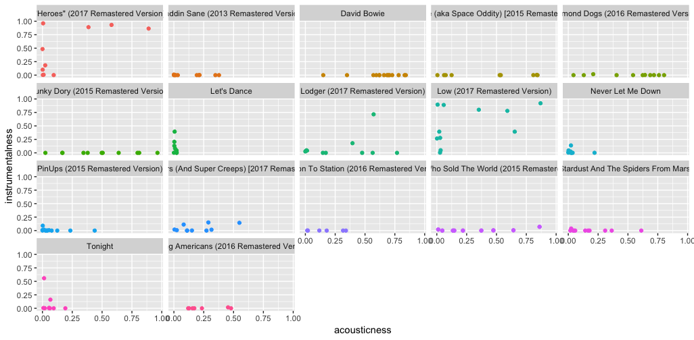

## Computational Musicology - David Bowie

David Bowie created an expansive body of work. Spotify's biography of him starts by noting that "[t]he cliché about David Bowie is that he was a musical chameleon [...]" What patterns can we find in his many coloured oeuvre? Does clustering show the Berlin trilogy as an entity separate from the other albums? If so, can we see an influence of recording location in general? Do the albums with producer Tony Visconti form a cluster? I hope to visualise some interesting results.

The corpus consists of the studio albums. Compilations, live albums and rarities will be excluded from the selection. This is to prevent overlap and to focus the results.

<!--"this is a comment."-->
